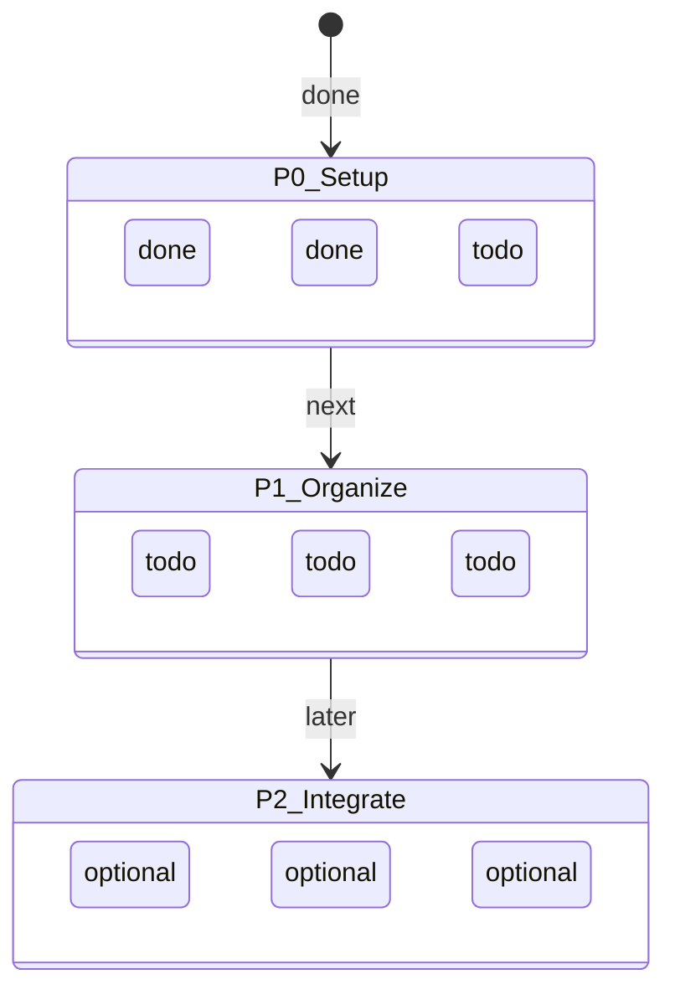

# Project Canvas

## Summary

This starter canvas is safe for public snapshots. Replace it with your own
project stages after `tm init`.

中文说明：项目画布是 TigerMemory 的项目进展入口，用来记录阶段、
活跃模块、阻塞点和下一步。

## Current State

## 活跃模块

| 模块 | 状态 | 最后更新 | 负责 |
|---|---|---|---|
| Local Setup | ✅ local profile ready after `tm init` | starter | human |
| First Memory | ⚪ write and verify your first local memory | starter | human |
| Wiki Organization | ⚪ add project notes under `wiki/` | starter | human |
| Hybrid Integrations | ⚪ optional OpenMemory and multi-IDE setup | starter | human |

## Current Blockers

- none

## Sources

- Public TigerMemory starter template.
